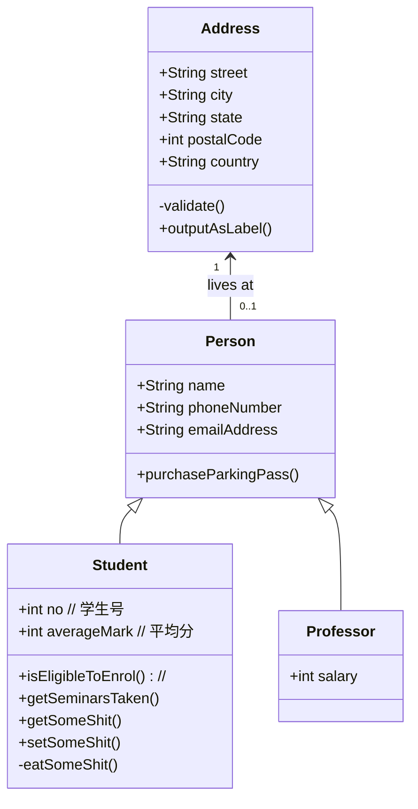
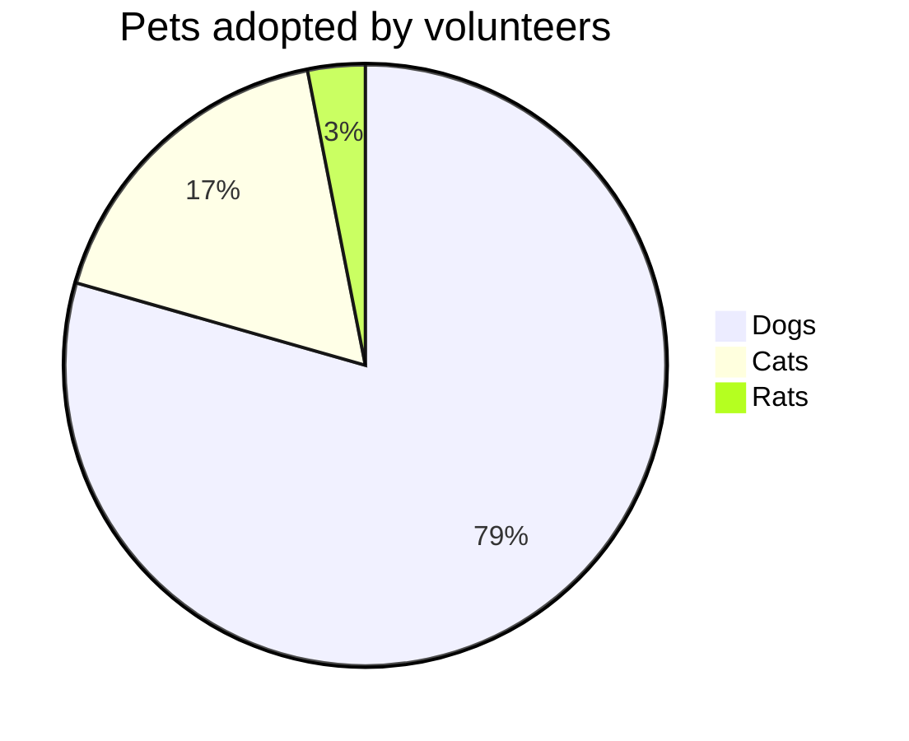

###  ###
# 一,告诫 #

## 1.配置 ##
告诫，允许使它们可折叠并在告诫中嵌套任意内容

	markdown_extensions:
		- admonition
		- pymdownx.details
		- pymdownx.superfences
### 告诫图标 ###
	theme.icon.admonition
		note: octicons/tag-16	# <type> : <icon>
		abstract: octicons/checklist-16
		info: octicons/info-16
		tip: octicons/squirrel-16
		success: octicons/check-16
		question: octicons/question-16
		warning: octicons/alert-16
		failure: octicons/x-circle-16
		danger: octicons/zap-16
		bug: octicons/bug-16
		example: octicons/beaker-16
		quote: octicons/quote-16
或

	theme.icon.admonition
		note: fontawesome/solid/note-sticky
		abstract: fontawesome/solid/book
		info: fontawesome/solid/circle-info
		tip: fontawesome/solid/bullhorn
		success: fontawesome/solid/check
		question: fontawesome/solid/circle-question
		warning: fontawesome/solid/triangle-exclamation
		failure: fontawesome/solid/bomb
		danger: fontawesome/solid/skull
		bug: fontawesome/solid/robot
		example: fontawesome/solid/flask
		quote: fontawesome/solid/quote-left

## 2.用法 ##
块以 !!! 开头，后跟用作类型限定符的单个关键字。块的内容紧跟在下一行，缩进四个空格
如：
!!! note
	XXXXX

### 更改标题 ###
!!! note "标题"
	XXXXX
### 无标题 ###
!!! note ""
	XXXXX
// 不可折叠
### 可折叠块 ###
??? note
	以 ??? 开头
### 内联块 ###
!!! note inline "左对齐"
	```
	类型关键字后面紧跟 inline
	```
!!! note inline end "右对齐"
	类型关键字后面紧跟 inline end
<br><br><br>

## 3.定制 ##
### 旧版本告诫css ###
	.md-typeset .admonition, .md-typeset details {
		border-width: 0;
		border-left-width: 4px;
	}
### 自定义告诫css ###
	:root {
	  --md-admonition-icon--pied-piper: url('data:image/svg+xml;charset=utf-8,<svg xmlns="http://www.w3.org/2000/svg" viewBox="0 0 576 512"><path d="M244 246c-3.2-2-6.3-2.9-10.1-2.9-6.6 0-12.6 3.2-19.3 3.7l1.7 4.9zm135.9 197.9c-19 0-64.1 9.5-79.9 19.8l6.9 45.1c35.7 6.1 70.1 3.6 106-9.8-4.8-10-23.5-55.1-33-55.1zM340.8 177c6.6 2.8 11.5 9.2 22.7 22.1 2-1.4 7.5-5.2 7.5-8.6 0-4.9-11.8-13.2-13.2-23 11.2-5.7 25.2-6 37.6-8.9 68.1-16.4 116.3-52.9 146.8-116.7C548.3 29.3 554 16.1 554.6 2l-2 2.6c-28.4 50-33 63.2-81.3 100-31.9 24.4-69.2 40.2-106.6 54.6l-6.3-.3v-21.8c-19.6 1.6-19.7-14.6-31.6-23-18.7 20.6-31.6 40.8-58.9 51.1-12.7 4.8-19.6 10-25.9 21.8 34.9-16.4 91.2-13.5 98.8-10zM555.5 0l-.6 1.1-.3.9.6-.6zm-59.2 382.1c-33.9-56.9-75.3-118.4-150-115.5l-.3-6c-1.1-13.5 32.8 3.2 35.1-31l-14.4 7.2c-19.8-45.7-8.6-54.3-65.5-54.3-14.7 0-26.7 1.7-41.4 4.6 2.9 18.6 2.2 36.7-10.9 50.3l19.5 5.5c-1.7 3.2-2.9 6.3-2.9 9.8 0 21 42.8 2.9 42.8 33.6 0 18.4-36.8 60.1-54.9 60.1-8 0-53.7-50-53.4-60.1l.3-4.6 52.3-11.5c13-2.6 12.3-22.7-2.9-22.7-3.7 0-43.1 9.2-49.4 10.6-2-5.2-7.5-14.1-13.8-14.1-3.2 0-6.3 3.2-9.5 4-9.2 2.6-31 2.9-21.5 20.1L15.9 298.5c-5.5 1.1-8.9 6.3-8.9 11.8 0 6 5.5 10.9 11.5 10.9 8 0 131.3-28.4 147.4-32.2 2.6 3.2 4.6 6.3 7.8 8.6 20.1 14.4 59.8 85.9 76.4 85.9 24.1 0 58-22.4 71.3-41.9 3.2-4.3 6.9-7.5 12.4-6.9.6 13.8-31.6 34.2-33 43.7-1.4 10.2-1 35.2-.3 41.1 26.7 8.1 52-3.6 77.9-2.9 4.3-21 10.6-41.9 9.8-63.5l-.3-9.5c-1.4-34.2-10.9-38.5-34.8-58.6-1.1-1.1-2.6-2.6-3.7-4 2.2-1.4 1.1-1 4.6-1.7 88.5 0 56.3 183.6 111.5 229.9 33.1-15 72.5-27.9 103.5-47.2-29-25.6-52.6-45.7-72.7-79.9zm-196.2 46.1v27.2l11.8-3.4-2.9-23.8zm-68.7-150.4l24.1 61.2 21-13.8-31.3-50.9zm84.4 154.9l2 12.4c9-1.5 58.4-6.6 58.4-14.1 0-1.4-.6-3.2-.9-4.6-26.8 0-36.9 3.8-59.5 6.3z"/></svg>')
	}
	.md-typeset .admonition.pied-piper,
	.md-typeset details.pied-piper {
	  border-color: rgb(43, 155, 70);
	}
	.md-typeset .pied-piper > .admonition-title,
	.md-typeset .pied-piper > summary {
	  background-color: rgba(43, 155, 70, 0.1);
	}
	.md-typeset .pied-piper > .admonition-title::before,
	.md-typeset .pied-piper > summary::before {
	  background-color: rgb(43, 155, 70);
	  -webkit-mask-image: var(--md-admonition-icon--pied-piper);
	          mask-image: var(--md-admonition-icon--pied-piper);
	}

!!! pied-piper "Pied Piper"
	自定义告诫 pied-piper

# 二.注释 #

## 1.配置 ##
	markdown_extensions:
		- attr_list
		- md_in_html
		- pymdownx.superfences
### 2.用法(付费) ###
Lorem ipsum dolor sit amet, (1) consectetur adipiscing elit.
{ .annotate }

1.  :man_raising_hand: I'm an annotation! I can contain `code`, __formatted
    text__, images, ... basically anything that can be expressed in Markdown.


# 三.按钮 #

## 1.配置 ##
	markdown_extensions : - attr_list
## 2.用法 ##
### 添加按钮 ###
要将链接呈现为按钮，请使用大括号为其后缀，并向其添加类选择器。该按钮将接收选定的原色和主题色（如果处于活动状态）

	[](){ .md-button }
如:

	[bing一下](http://www.bing.com){ .md-button }
[bing一下](http://www.bing.com){ .md-button }

### 添加主按钮 ###
如:

	[bing一下](http://www.bing.com){ .md-button .md-button--primary }
[bing一下](http://www.bing.com){ .md-button .md-button--primary }
### 添加图标(略) ###


# 四.代码块 #

## 1.配置 ##
允许在代码块和内联代码块上突出显示语法，并允许直接从其他文件包含源代码

	markdown_extensions:
		- pymdownx.highlight:
			anchor_linenums: true
		- pymdownx.inlinehilite
		- pymdownx.snippets
		- pymdownx.superfences
### 代码复制按钮 ###
全局设置

	theme.features : - content.code.copy
局部设置

	``` { .yaml .copy }
	XXXXXX
	```
	或
	``` { .yaml .no-copy }
	XXXXXX
	#sdf
	```
### 代码注释 ###
mkdocs.yml:

	theme.features : - content.code.annotate
XX.md:

	```{ .yaml .annotate }
	XXXXXX
	```
#### 锚注释(略) ####

## 2.用法 ##

### 添加标题 ###
比如添加如下代码，以及得到的效果：

	```cpp title="标题"
	XXXXXXX
	```

```cpp title="标题"
XXXXXXX
```
### 添加批注 ###
在特定语言的代码块内，在规定的注释内添加 (x)，并且在代码块后加入 "(x)    批注内容"，即可实现批注效果 (批注的内容和代码块之前必须至少有一个空行)

以c++为例，源码和效果：

	```cpp
	// (4)
	int a, b; cin >> a >> b;	// (1)
	cout << a + b << '\n';		/* (2) */
								// (3)!
	```
	
	4.	批注的内容和代码块之前必须至少有一个空行
	1.  声明变量a, b并输入
	2.	输出a+b
	3.	剥离注释

```cpp
// (4)
int a, b; cin >> a >> b;	// (1)
cout << a + b << '\n';		/* (2) */
							// (3)!
```

4.	批注的内容和代码块之前必须至少有一个空行
1.  声明变量a, b并输入
2.	输出a+b
3.	剥离注释


### 添加行号 ###
代码块添加 `linenums="起始行号"` 属性即可

源码和效果：

	```cpp linenums="1"
	int a, b; cin >> a >> b;
	cout << a + b << '\n';
	```

```cpp linenums="1"
int a, b; cin >> a >> b;
cout << a + b << '\n';
```

### 突出显示特定行 ###
代码块添加属性 hl_lines="行号列表" 即可

源码和效果:

	``` cpp linenums="11" hl_lines="2 3"
	int a, b; 
	cin >> a >> b;
	cout << a + b << '\n';
	```

```cpp linenums="11" hl_lines="2 3"
int a, b; 
cin >> a >> b;	// (1)!
cout << a + b << '\n';
```

1.	hl_lines 中指定的是绝对行号，与linenums的值无关


### 突出显示内联代码块 ###
如下内源码将高亮语言本身特色的元素
	`#!语言名  内联代码...`

源码和效果:

	`#!cpp int a, b; cin >> a >> b; cout << a + b << '\n';`
`#!cpp int a, b; cin >> a >> b; cout << a + b << '\n';`

### 嵌入外部文件 ###
如：

	``` title=".browserslistrc"
	--8<-- ".browserslistrc"
	```

// 参考 : [--8<--记法](https://facelessuser.github.io/pymdown-extensions/extensions/snippets/#snippets-notation)

## 2.定制 ##

### 自定义语法主题(略) ###
### 批注工具宽度 ###
```title="docs/css/extra.css"
:root {
  --md-tooltip-width: 600px;
}
```
### 带数字的注释 ###
为了避免混淆，新版本采用了 "+"作为注释符号，而旧版本使用 数字 作为注释符号

以下代码可以恢复旧版本的注释

```title="docs/css/extra.css"
.md-typeset .md-annotation__index > ::before {
  content: attr(data-md-annotation-id);
}
.md-typeset :focus-within > .md-annotation__index > ::before {
  transform: none;
}
```

# 5.内容选项卡(付费) #

## 1.配置 ##

	markdown_extensions:
		- pymdownx.superfences
		- pymdownx.tabbed:
			alternate_style: true 
### 锚链接 ###
为了链接到内容选项卡并更轻松地共享它们，Insiders 会自动为每个内容选项卡添加一个锚链接

	markdown_extensions:
		- pymdownx.tabbed:
			slugify: !!python/object/apply:pymdownx.slugs.slugify
				kwds:
					case: lower
### 链接的内容选项卡 ###
启用后，整个文档网站中的所有内容选项卡都将链接，并在用户单击选项卡时切换到同一标签

	theme.features : - content.tabs.link

## 2.用法 ##
=== "源码"
		=== "选项卡1"
			``` c
			#include <stdio.h>
			
			int main(void) {
			  printf("Hello world!\n");
			  return 0;
			}
			```
		=== "选项卡2"
			``` c++
			#include <iostream>
			
			int main(void) {
			  std::cout << "Hello world!" << std::endl;
			  return 0;
			}
			```
=== "效果"
	=== "选项卡1"
		``` c
		#include <stdio.h>
		
		int main(void) {
		  printf("Hello world!\n");
		  return 0;
		}
		```
	=== "选项卡2"
		``` c++
		#include <iostream>
		
		int main(void) {
		  std::cout << "Hello world!" << std::endl;
		  return 0;
		}
		```


# 6.数据表 #

## 1.配置 ##
	markdown_extensions : - tables
## 2.用法 ##
### 列对齐 ###
=== "左"
		| Method      | Description                          |
		| :---------- | :----------------------------------- |
		| `GET`       | :material-check:     Fetch resource  |
		| `PUT`       | :material-check-all: Update resource |
		| `DELETE`    | :material-close:     Delete resource |
	| Method      | Description                          |
	| :---------- | :----------------------------------- |
	| `GET`       | :material-check:     Fetch resource  |
	| `PUT`       | :material-check-all: Update resource |
	| `DELETE`    | :material-close:     Delete resource |
=== "中"
		| Method      | Description                          |
		| :---------: | :----------------------------------: |
		| `GET`       | :material-check:     Fetch resource  |
		| `PUT`       | :material-check-all: Update resource |
		| `DELETE`    | :material-close:     Delete resource |
	| Method      | Description                          |
	| :---------: | :----------------------------------: |
	| `GET`       | :material-check:     Fetch resource  |
	| `PUT`       | :material-check-all: Update resource |
	| `DELETE`    | :material-close:     Delete resource |
=== "右"
		| Method      | Description                          |
		| ----------: | -----------------------------------: |
		| `GET`       | :material-check:     Fetch resource  |
		| `PUT`       | :material-check-all: Update resource |
		| `DELETE`    | :material-close:     Delete resource |
	| Method      | Description                          |
	| ----------: | -----------------------------------: |
	| `GET`       | :material-check:     Fetch resource  |
	| `PUT`       | :material-check-all: Update resource |
	| `DELETE`    | :material-close:     Delete resource |

!!! note "基本结构"
	
	```cpp
	|	字段1	|	字段2	|
	| :------:	|	:---:	|
	|			|			|//(1)!
	|			|			|//(2)!
	....
	|			|			|//(3)!
	```

	1.	第一条记录
	2.	第二条记录
	3.	第n条记录

## 3.定制 ##
### 可排序表 ###
=== "mkdocs.yml"
		extra_javascript : 
			- https://unpkg.com/tablesort@5.3.0/dist/tablesort.min.js
			- XXX.js
=== "XXX.js"
		document$.subscribe(function() {
		  var tables = document.querySelectorAll("article table:not([class])")
		  tables.forEach(function(table) {
		    new Tablesort(table)
		  })
		})


# 7.图 #
图表有助于传达不同技术组件之间的复杂关系和互连，并且是项目文档的重要补充。MkDocs的材料与Mermaid.js集成，这是一种非常流行且灵活的图表绘制解决方案

## 1.配置 ##
	markdown_extensions:
	  - pymdownx.superfences:
	      custom_fences:
	        - name: mermaid
	          class: mermaid
	          format: !!python/name:pymdownx.superfences.fence_code_format
## 2.用法 ##
### 流程图 ###
流程图是表示工作流或流程的图表
=== "源码"
		``` mermaid
		graph LR
		  A[Start] --> B{Error?};
		  B -->|Yes| C[Hmm...];
		  C --> D[Debug];
		  D --> B;
		  B ---->|No| E[Yay!];
		```
=== "效果"
	``` mermaid
	graph LR
	  A[Start] --> B{Error?};
	  B -->|Yes| C[Hmm...];
	  C --> D[Debug];
	  D --> B;
	  B ---->|No| E(Yay!);
	```

!!! note
	|元素|作用|备注|
	|:-:|:-:|:-:|
	|`-->`|结点之间的有向边|可拉长, 如:`----->`|
	|`|XXX|`|结点之间的关系(如: 边权)|紧跟在`-->`右边|
	|`[XXX]`|结点别名; 方框|紧跟在结点右边|
	|`{XXX}`|结点别名; 菱形||
	|`(XXX)`|结点别名; 圆角方框||
	|graph|声明流程图|默认为纵向图|
	|graph LR|横向图||


### 序列图 ###
序列图将特定方案描述为多个对象或参与者之间的顺序交互，包括这些参与者之间交换的消息
=== "源码"
		``` mermaid
		sequenceDiagram
		autonumber
		
		  Alice ->> John: 你好，John，你好吗?
		  loop 健康检查
		      John ->> John: 对抗疑病症
		  end
		  Note right of John: 理性思维!
		  John -->> Alice: 没, 没事!
		  John ->> Bob: 你还好吗?
		  Bob -->> John: "好"极了!
		```
=== "效果"
	``` mermaid
	sequenceDiagram
	autonumber
	
	  Alice ->> John: 你好，John，你好吗?
	  loop 健康检查
	      John ->> John: 对抗疑病症
	  end
	  Note right of John: 理性思维!
	  John -->> Alice: 没, 没事!
	  John ->> Bob: 你还好吗?
	  Bob -->> John: "好"极了!
	  John --> Bob: 我两都没事
	```
!!! note
	|元素|作用|备注|
	|:-:|:-:|:-:|
	|`->`|结点之间的无向实边|不可拉长|
	|`->>`|结点之间的有向实边||
	|`-->`|结点之间的无向虚边||
	|`-->>`|结点之间的有向虚边||
	|loop 循环名 ... end|循环|循环内的包含不少于1个语句|
	|sequenceDiagram|声明序列图||
	|autonumber|自动为交互行为标号||

### 状态图 ###
状态图是描述系统行为的好工具，将其分解为有限数量的状态，以及这些状态之间的转换
=== "源码"
		``` mermaid
		stateDiagram-v2
		state fk <<fork>>
		state jn <<join>>
		
		[*] --> fk
		fk --> a
		fk --> b
		fk --> c
		
		a --> jn
		b --> jn
		c --> jn
		jn --> [*]
		
		```
=== "效果"
	``` mermaid
	stateDiagram-v2
	state fk <<fork>>
	state jn <<join>>
	
	[*] --> fk
	fk --> a
	fk --> b
	fk --> c
	
	a --> jn
	b --> jn
	c --> jn
	jn --> [*]
	
	```
!!! note
	|元素|功能|备注|
	|:-:|:-:|:-:|
	|`[*]`|源点/汇点|仅当`[*]`位于`-->`左边时为源点,反之为汇点|
	|`-->`|有向边||
	|stateDiagram-v2|声明状态图||
	|state XXX <<`fork`/`join`>>|将XXX定义为`fork`或`join`</br>类似于c中的宏|`fork`意为'分叉'，在图中作为局部源点,</br> 反之`join`作为局部汇点|


### 类图 ###
类图是面向对象编程的核心，通过将实体建模为类和它们之间的关系来描述系统的结构:



### [其他图表类型](https://mermaid.js.org/syntax/flowchart.html) ###



# 8.脚注 #

## 1.配置 ##
	markdown_extensions : - footnotes
## 2.用法 ##
### 添加脚注引用 ###

=== "源码"
		Lorem ipsum[^1] dolor sit amet, consectetur adipiscing elit.[^2]
		
		[^1]:	第一个脚注内容
		[^2]:
			第二个脚注内容
			并且是一个多行脚注
=== "效果"
	Lorem ipsum[^1] dolor sit amet, consectetur adipiscing elit.[^2]
	
	[^1]:	第一个脚注内容
	[^2]:	
		第二个脚注内容
		并且是一个多行脚注

# 9.(文本)格式 #

## 1.配置 ##
	markdown_extensions:
		- pymdownx.critic
		- pymdownx.caret
		- pymdownx.keys
		- pymdownx.mark
		- pymdownx.tilde
## 用法 ##

### 突出显示所做的修改 ###
	- { --删除文本-- }
	- { ++添加文本++ }
	- { ~~原文本~>现有文本~~ }
	- { >>注释<< }
	- { ==高亮== }

- {--删除文本--}
- {++添加文本++}
- {~~原文本~>现有文本~~}
- {>>注释<<}
- {==高亮==}

==注意：这些格式对代码块有效; 为了方便演示, 上面的代码块在{ }旁边加了空格以使格式失效==
### 高亮文本 ###
	- ==高亮==
	- ^^下划线^^
	- ~~删除线~~
- ==高亮==
- ^^下划线^^
- ~~删除线~~
### 上下标 ###
	- f~x~
	- e^x^
- f~x~
- e^x^
### 添加键盘键 ###
++ctrl+alt+del++


# 10.网格 #

## 1.配置 ##
	markdown_extensions:
		- attr_list
		- md_in_html
## 2.用法(没用, 略) ##

# 11.图标，表情符号 #

## 1.配置 ##
	markdown_extensions:
		- attr_list
		- pymdownx.emoji:
			emoji_index: !!python/name:materialx.emoji.twemoji
			emoji_generator: !!python/name:materialx.emoji.to_svg
## 2.用法 ##

### 图标 ###
获取图标短代码的方式: `python3.9/Lib/site-packages/material/.icons`路径下的`.svg`符号文件相对`.icons`的路径，用`-`替代其中的`/`，即可得到图标的短代码

引用方式: `:短代码:`

	:octicons-heart-fill-24:
:octicons-heart-fill-24:
### 表情符号 ###
如果您使用的是 [Twemoji](https://twemoji.twitter.com/)（推荐），您可以在[表情百科](https://emojipedia.org/twitter/)上查找简码
### 颜色 和 动画 ###
=== "XXX.css"
		.类名{
			/* 颜色 */
			color: cyan;
			/* 动画(心跳) */
			animation: heart 1000ms infinite;
		}
		/* 有关动画(心跳)的css配置 */
		@keyframes heart {
			0%, 40%, 80%, 100% {
				transform: scale(1);
			}
			20%, 60% {
				transform: scale(1.15);
			}
		}
=== "XXX.md"
		:octicons-heart-fill-24:{ .类名 }
	效果: :octicons-heart-fill-24:{ .hb }
### 在导航、侧边栏中使用图标(报错) ###
借助内置排版插件typeset使得导航和标签保留markdown和html格式，即可实现
=== "cmd"
		// 不会安装typeset!
=== "mkdocs.yml"
		plugins:
			- typeset

`#!cpp int `


!!! warning
	不会安装typeset!

## 3.定制(略) ##

# 12.图像 #

## 1.配置 ##
	markdown_extensions:
		- attr_list
		- md_in_html
### 插件——glightbox ###
glightbox插件可提供**图像缩放**功能

=== "cmd"
		pip install mkdocs-glightbox
=== "mkdocs.yml"
		plugins : - glightbox

## 2.用法 ##
### 图片对齐 ###
??? 源码
		{align=left}
		
			只因你太美 baby 只因你太美 baby
			只因你实在是太美 baby 只因你太美 baby
			迎面走来的你让我如此蠢蠢欲动
			这种感觉我从未有
			Cause I got a crush on you who you
			你是我的我是你的谁
			再多一眼看一眼就会爆炸
			再近一点靠近点快被融化
			想要把你占为己有baby bae
			不管走到哪里都会想起的人是你 you you
			我应该拿你怎样
			uh 所有人都在看着你
			我的心总是不安
			oh 我现在已病入膏肓
			...
{align=left}

	只因你太美 baby 只因你太美 baby
	只因你实在是太美 baby 只因你太美 baby
	迎面走来的你让我如此蠢蠢欲动
	这种感觉我从未有
	Cause I got a crush on you who you
	你是我的我是你的谁
	再多一眼看一眼就会爆炸
	再近一点靠近点快被融化
	想要把你占为己有baby bae
	不管走到哪里都会想起的人是你 you you
	我应该拿你怎样
	uh 所有人都在看着你
	我的心总是不安
	oh 我现在已病入膏肓
	...

<iframe frameborder="no" border="0" marginwidth="0" marginheight="0" width=100% height=86 src="https://music.163.com/outchain/player?type=2&id=1340439829&auto=0&height=66"></iframe>
<iframe frameborder="no" border="0" marginwidth="0" marginheight="0" width=100% height=86 src="https://music.163.com/outchain/player?type=2&id=1948109333&auto=0&height=66"></iframe>
### 图片说明 ###
!!! 源码
	```html
	<figure markdown>
	  { width="300" }
	  <figcaption>kun</figcaption>
	</figure>
	```
<figure markdown>
  { width="300" }
  <figcaption>kun</figcaption>
</figure>
### 图像延迟加载 ###

```html
{ loading=lazy }
```
### 明暗模式 ###
	
	


# 13.列表 #

## 1.配置 ##
	markdown_extensions:
		- def_list
		- pymdownx.tasklist:
			custom_checkbox: true

## 2.用法 ##
### 无序列表 ###
!!! 支持三种无需列表(可任意嵌套)

	`+ `
	`- `
	`* `
### 有序列表 ###

```c
`x. `	// (1)!
```

1.	x表示某个整数


### 定义列表 ###

!!! 源码
	
		`key1`
		:	XXXXXXXXXXXXXXXXXXXXXXXXX
			XXXXXXXXXXXXXXXXXXXXXX
		
		`key2`
		:	XXXXXXXXXXXXXXXXXXXXXXXXX
			XXXXXXXXXXXXXXXXXXXXXX
			
			XXXXXXXXXXXXXXX

`key1`
:	XXXXXXXXXXXXXXXXXXXXXXXXX
	XXXXXXXXXXXXXXXXXXXXXX

`key2`
:	XXXXXXXXXXXXXXXXXXXXXXXXX
	XXXXXXXXXXXXXXXXXXXXXX
	
	XXXXXXXXXXXXXXX


# 14.MathJax #

## 1.配置 ##

=== "mkdocs.yml"
		markdown_extensions:
			- pymdownx.arithmatex:
				generic: true
		
		extra_javascript:
			- XXX.js
			- https://polyfill.io/v3/polyfill.min.js?features=es6
			- https://cdn.jsdelivr.net/npm/mathjax@3/es5/tex-mml-chtml.js
=== "XXX.js"
		window.MathJax = {
		  tex: {
		    inlineMath: [["\\(", "\\)"]],
		    displayMath: [["\\[", "\\]"]],
		    processEscapes: true,
		    processEnvironments: true
		  },
		  options: {
		    ignoreHtmlClass: ".*|",
		    processHtmlClass: "arithmatex"
		  }
		};
		
		document$.subscribe(() => { 
		  MathJax.typesetPromise()
		})

## 2.用法 ##
MathJax是一种在浏览器中显示数学内容的美观且易于访问的方式，增加了对不同符号（例如[LaTeX](https://en.wikibooks.org/wiki/LaTeX/Mathematics)，[MathML](https://en.wikipedia.org/wiki/MathML)，[AsciiMath](http://asciimath.org/)）的数学排版的支持，并且可以轻松地与MkDocs的材料集成

### 块语法 ###

	$$  ...  $$ 或 \[  ...  \]
	
	又或者
	
	$$
		...
	$$

	或

	\[
		...
	\]
	
### 内联语法 ###

	$  ...  $ 或 \(  ...  \)

# 十五.工具提示 #

## 1.配置 ##

	markdown_extensions:
		- abbr
		- attr_list
		- pymdownx.snippets

### 改进的工具提示 ###
	theme:
		features:
			- content.tooltips


## 2.用法 ##
### 工具提示 ###
-	任何链接都可加上工具提示

```
[kun(悬停我!)](https://pic.peo.pw/a/2023/01/14/63c29b784ad44.png {=="ikun们的珍宝"==})
```
[kun(悬停我!)](https://pic.peo.pw/a/2023/01/14/63c29b784ad44.png "ikun们的珍宝")

-	还可以将工具提示添加到链接引用中

```
[Hover me][xxx]
[xxx]: https://example.com "我是一个工具提示"
```
[Hover me][xxx]
[xxx]: https://example.com "我是一个工具提示"

-	对于所有元素, 此种方法都可以添加工具提示

```
元素{ title="工具提示的内容" }
```
:smile:{title="工具提示的内容"}

### 缩写 ###

!!! 源码
	```
	*[维护]: $\int_{a}^{b}f_x d_x$
	
	HTML 规范由 W3C 维护
	
	*[HTML]: Hyper Text Markup Language
	*[W3C]: World Wide Web Consortium
	```

*[维护]: $\int_{a}^{b}f_x d_x$

HTML 规范由 W3C 维护

*[HTML]: Hyper Text Markup Language
*[W3C]: World Wide Web Consortium


!!! warning
	1.	缩写的解释内容可以在使用前或使用后定义, 使用缩写时左右必须有空格
	2.	对于缩写的解释内容是不支持mathjax的

### 词汇表 ###
添加 Snippets 扩展以通过移动专用文件中的所有缩写来实现简单的词汇表, 并使用以下配置将此文件自动附加到所有页面:

=== "mkdocs.yml"
	
		markdown_extensions:
			- pymdownx.snippets:
				auto_append:
					- {==includes/abbreviations.md==}
=== "{==includes/abbreviations.md==}"
	
		*[HTML]: Hyper Text Markup Language
		*[W3C]: World Wide Web Consortium
		--8<-- "code/add.cpp"


--8<-- "code/add.cpp"